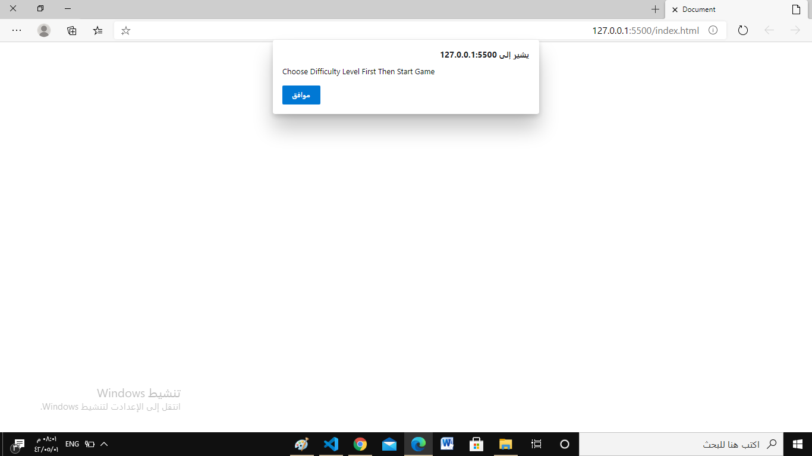
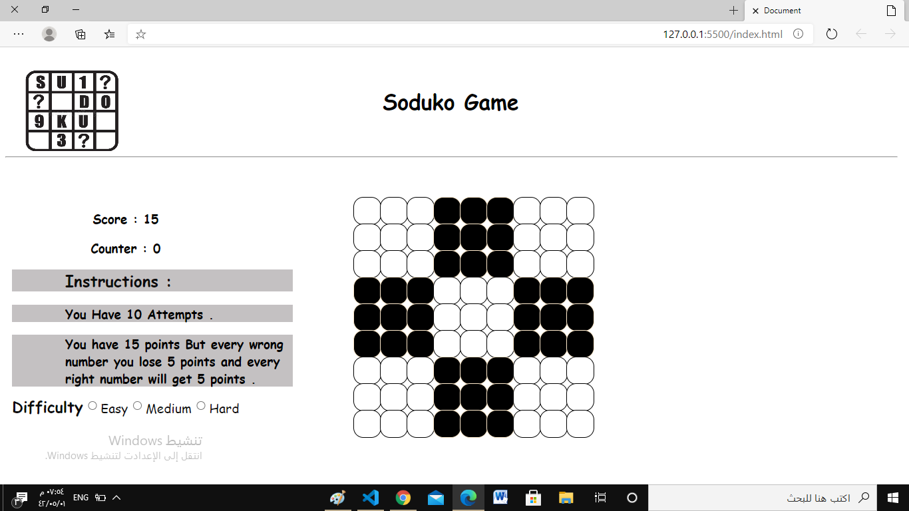
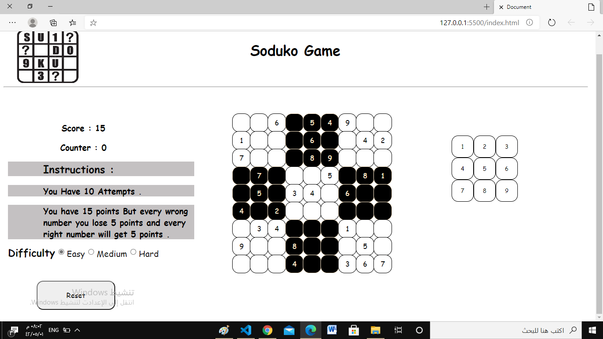
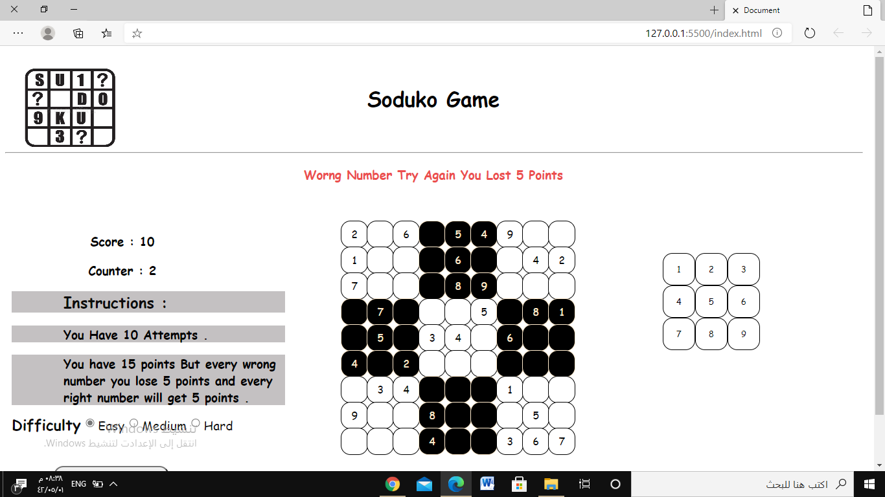
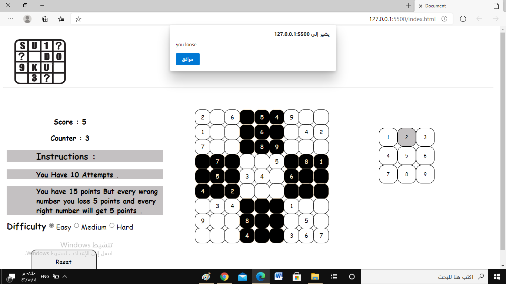
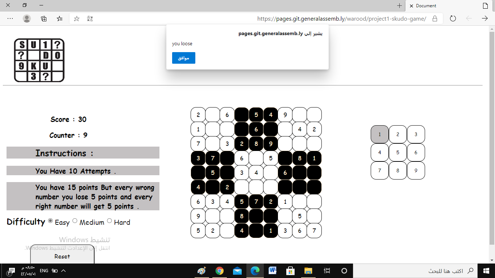
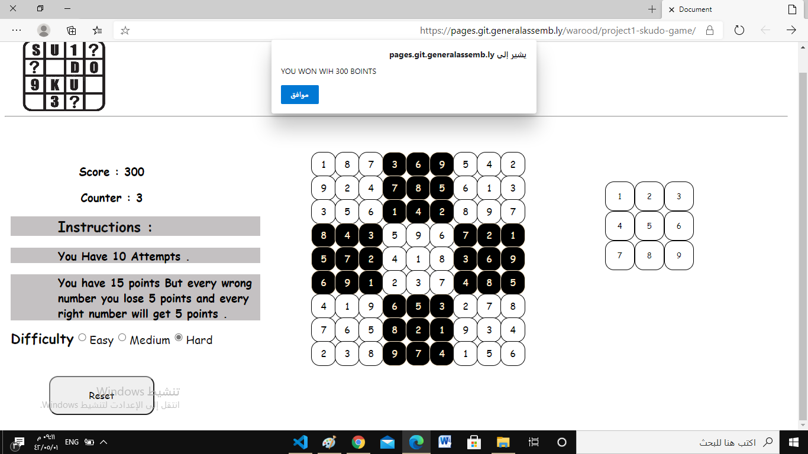

# project1-sudoku-game

## What is sudoku game and how play it?

It is number game , just one player, choose empty cell and check every number in row and column that crosses this cell and put number different from all numbers there .

### Steps To Develope SUDOKU Game :

* Draw wireframe . [wireframe](https://git.generalassemb.ly/warood/project1-skudo-game/blob/master/screenshot/image0%20(1).jpeg)
* Thinking logically how I can translate the game from paper with my basic knowledges.
* Write algorithm .
* Coding .
* Test .
* DEPLOY it .

### languages used :
* HTML.
* CSS.
* JavaScript.

### Editor :
VS Code.

### Screenshots Explains Game :

### Choose difficulty first then press start .

### when choose easy level .

### Every wrong number you lose 5 points and 1 from 10 attempts .

### when lose all scores .

### when loose all attempts .

### The web page when you win

## Game Link
[game link](https://pages.git.generalassemb.ly/warood/project1-skudo-game/)
